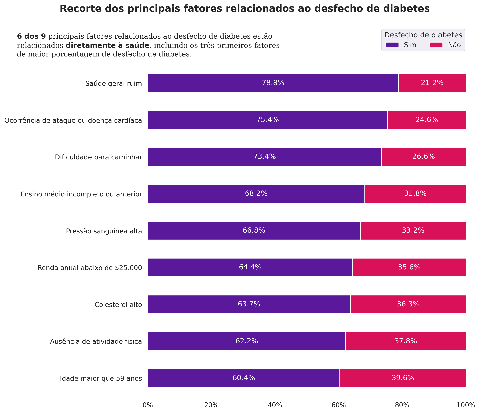

# Projeto diabetes - análise de dados


Diabetes é uma doença crônica grave na qual os indivíduos perdem a capacidade de regular efetivamente os níveis de glicose no sangue e pode levar a uma redução na qualidade de vida e na expectativa de vida.

O Sistema de Vigilância de Fatores de Risco Comportamentais (BRFSS) é uma pesquisa telefônica relacionada à saúde que é coletada anualmente pelo CDC (Centro de Controle e Prevenção de Doenças dos Estados Unidos). A cada ano, a pesquisa coleta respostas de milhares de americanos sobre comportamentos de risco relacionados à saúde, condições crônicas de saúde e o uso de serviços preventivos. Para este projeto, foi utilizado conjunto de dados disponível no Kaggle para o ano de 2015.

Fonte dos dados: [Kaggle](https://www.kaggle.com/datasets/alexteboul/diabetes-health-indicators-dataset)

[Notebooks desenvolvidos no projeto](./notebooks/)

## Resultados principais



Gráfico desenvolvido [neste notebook](./notebooks/projeto_diabetes_03_resultados_principais.ipynb) após realização das análises prévias nos demais notebooks.

## Organização do projeto

```
├── LICENSE            <- Licença de código aberto.
├── README.md          <- Instruções e detalhes do projeto.
├── requirements.txt   <- Principais dependências para execução do projeto e suas versões.
|
├── dados              <- Arquivos de dados para o projeto.
|
├── notebooks          <- Cadernos Jupyter. A numeração indica a ordem em que as etapas
|                         foram executadas.
│
|   └──src             <- Dados centralizados organizados para uso neste projeto.
|      │
|      ├── __init__.py  <- Torna um módulo Python.
|      ├── config.py    <- Configurações básicas de caminhos de arquivos do projeto.
|
├── imagens            <- Imagens utilizadas nos arquivos do projeto.
```
